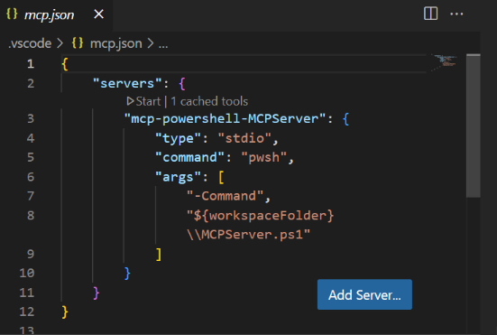
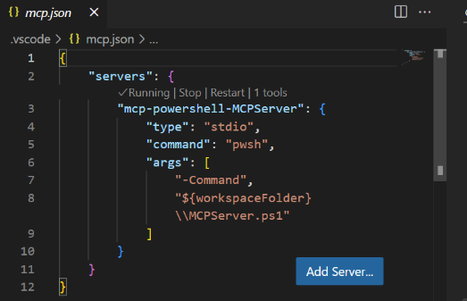

<p align="center">
    
</p>

# PowerShell MCP - PSMCP

Transform your PowerShell scripts into intelligent, AI-driven services that respond to natural language. 
PowerShell Model Context Protocol (PSMCP) bridges the gap between your code and large language models, enabling seamless AI-human-code collaboration without complex configuration.

No YAML, no friction. Just prompts, tools, and instant execution.
It's not automation. It's collaboration.

## In Action
🔧 What you'll see:

☑️Using New-MCP to scaffold a working AI server

☑️Integration with GitHub Copilot in Agent Mode

☑️Live demo: Add a PowerShell function, restart the server, and the AI just knows

This isn’t just code—it’s a conversation.

 <a href="https://youtu.be/S_JQlFj9nak"></a>

----

## Install PSMCP

```
Install-Module PSMCP 

New-MCP d:\temp\testMCP
code-insiders d:\temp\testMCP
```

## Install VS Code Insiders

To use PSMCP effectively, you'll need VS Code Insiders. Here's how to install it:

1. Visit the [VS Code Insiders download page](https://code.visualstudio.com/insiders/)
2. Download the appropriate version for your operating system
3. Run the installer and follow the on-screen instructions


## Set up GitHub Copilot in VS Code
This guide walks you through setting up GitHub Copilot in Visual Studio Code. To use Copilot in VS Code, you need to have access to GitHub Copilot with your GitHub account.

[GitHub Copilot Setup Guide](https://code.visualstudio.com/docs/copilot/setup)


## Getting Started with PSMCP

### New MCP

Start by creating a new MCP server with a simple command. This scaffolds the necessary files and sets the stage for dynamic AI interaction.


Once initialized, you're ready to configure your MCP tools—no YAML, no fuss.


### MCP JSON

The JSON file defines your available tools. In this example, we’re creating a simple Invoke-Addition function.



Clicking "Start" embeds the tool definition into the MCP config. Now it’s registered and ready to go.

## After Clicking Start
With the tool registered, starting the server wires up everything under the hood.




The server is hot and listening. Now you can talk to your code like it’s a teammate.

### Let's Prompt

Time to interact. Drop a natural language prompt and let the AI figure out which function to use.


Your intent is recognized—and the AI knows exactly what tool to invoke.

### Copilot Wants to Run your function

Copilot steps in, proposing to call your registered function based on your prompt.


Confirm to execute and let the AI orchestrate the rest.

## Expand the Run
Peek under the hood—see the actual arguments passed to your function.


Confirm to execute and let the AI orchestrate the rest.

### After Run
Execution complete. The function ran with your inputs, and now you get the result.


This isn’t just code—it’s a conversation. One prompt, one response, and a world of automation opens up.

🟨 Conclusion
This workflow redefines how we build and run tools. From scaffolding an MCP server to interacting with it using plain language, the line between prompt and program is disappearing.

No more brittle glue code. No more hand-rolling APIs. Just describe what you want, and your AI-enhanced PowerShell server takes it from there—registering, invoking, and summarizing functions on demand.

Welcome to the future of coding.
It’s not just execution—it’s collaboration.

## Contributing to PSMCP

Contributions are welcomed from the community! Whether you're fixing bugs, adding features, improving documentation, or sharing examples, your help makes PSMCP better.

### How to Contribute

1. **Fork the repository** - Create your own copy of the project to work with
2. **Create a branch** - Make your changes in a new branch
3. **Submit a pull request** - Once you're happy with your changes, submit a PR for review
4. **Discuss and review** - Collaborate with maintainers to refine your contribution
5. **Get merged** - Once approved, your changes will become part of PSMCP

### Types of Contributions We're Looking For

- Bug fixes and issue reports
- New features and enhancements
- Documentation improvements
- Example scripts and usage scenarios
- Performance optimizations

Please ensure your code follows the project's style and includes appropriate tests.

For changes, please open an issue first to discuss what you would like to change.

Thank you to all our contributors who help make PSMCP better!